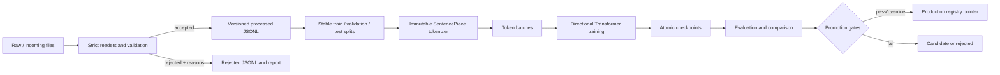
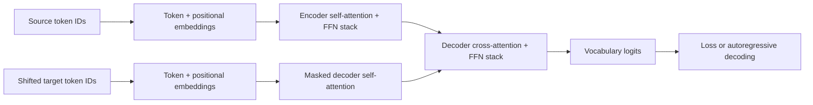
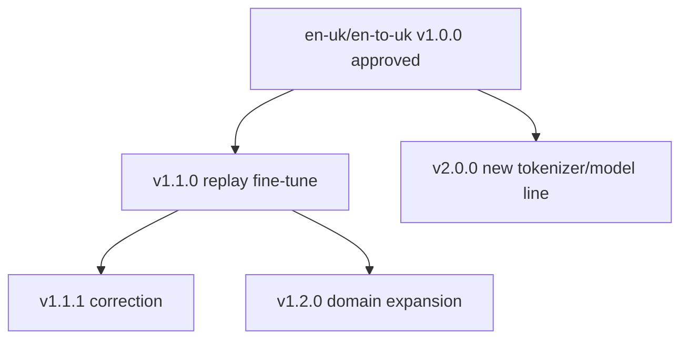

# NMT Platform Architecture

## Scope and invariants

This repository trains bilingual neural machine translation models from random
weights. It never downloads model weights, embeddings, tokenizer models, or
uses a hosted model. General-purpose packages provide tensor operations,
SentencePiece training, metrics, and the local user interface. Artifacts are
isolated by language-pair ID and translation direction. A language pair is
added through a dataset directory and a validated YAML file; core code never
contains English- or Ukrainian-specific behavior.

## Decisions

### Transformer implementation

The model is an explicit pre-normalized encoder-decoder Transformer. The code
owns token and positional embeddings, encoder/decoder layer flow, causal and
padding masks, residual connections, cross-attention, vocabulary projection,
loss preparation, greedy decoding, and beam search. `nn.MultiheadAttention`,
`nn.Linear`, `nn.Embedding`, `nn.LayerNorm`, and dropout are the only high-level
neural building blocks. Xavier, normal, or Kaiming initialization is applied to
new parameters; no state is loaded unless the user explicitly resumes or
fine-tunes a trusted local checkpoint.

### Direction and tokenizer boundaries

`en-to-uk` and `uk-to-en` are independent models under the `en-uk` namespace.
Each direction has its own registry, versions, checkpoints, metrics, and
production pointer. This makes asymmetric quality and independent promotion
visible. The initial pair uses one shared SentencePiece vocabulary trained only
on its processed training split, which improves coverage of names, punctuation,
and shared fragments. Configuration can instead train separate source and
target tokenizers. Tokenizer artifacts are immutable and content-addressed;
normal fine-tuning must reuse the parent tokenizer. A changed tokenizer begins
a new major model line because token IDs and learned embedding rows differ.

### Data ingestion, splitting, and fingerprinting

Readers support aligned `source.txt`/`target.txt`, TSV, CSV, and JSONL with
strict UTF-8 decoding. Every row is normalized, validated, and either retained
or written with one or more rejection reasons. Exact duplicates, conflicting
translations, repeated source/target text, extreme lengths/ratios, language
script mismatches, and malformed markup are reported separately.

A dataset version is the first 16 hexadecimal characters of SHA-256 over the
ordered source-file paths and bytes plus canonical JSON for preprocessing,
filter, and split settings. Its manifest stores all input hashes. Split
membership derives from a seeded hash of a leakage-resistant text signature,
not list position: previously seen examples therefore keep their validation or
test assignment when new data arrives. Exact pairs cannot cross splits and
simple punctuation/case/whitespace near-duplicates share a split. Optional
domain benchmarks are selected by a row's `domain` field.

### Versions, experiments, and metrics

Models receive immutable IDs of the form `<pair>-<direction>-vMAJOR.MINOR.PATCH`.
Fresh training creates a major line and fine-tuning creates a child minor or
patch version. A JSON registry is protected by a cross-platform file lock and
updated through atomic replacement. It records lineage, artifact references,
environment details, metrics, status, notes, protection, and production state.
Large tensors remain in checkpoint files rather than JSON.

Each run has an experiment directory containing `manifest.json`, newline JSON
metrics, structured logs, sample translations, checkpoints, and the terminal
result or failure. The UI tails these real files; it does not synthesize
progress. Metrics use stable field names and include the step and wall-clock
time so TensorBoard or a future MLflow/W&B adapter can be added without changing
training code.

### Checkpoints and recovery

Trusted PyTorch checkpoints contain model, optimizer, scheduler, AMP scaler,
epoch/step, sampler progress, best metric, early-stopping state, all relevant
config and artifact references, and Python/NumPy/PyTorch/CUDA RNG states. Saves
write a temporary file, flush and fsync it, then atomically replace the target.
`latest`, `best`, periodic, and `final` names are maintained with configurable
retention. Exact reproducibility is limited by device-specific kernels and
worker scheduling; deterministic mode opts into deterministic PyTorch behavior.
Checkpoint files use Python pickle internally and must only come from trusted
sources. Inference export uses a dynamic-shape `torch.export` PT2 graph plus a
JSON manifest and the exact SentencePiece models.

### Fine-tuning and replay

Fine-tuning never mutates its parent. New-data-only mode is available with an
explicit catastrophic-forgetting warning. Replay is the default: new rows are
mixed with deterministic historical samples by fixed percentage, fixed count,
balanced batches, weighted sampling, or domain-aware sampling. The parent test
and validation manifests remain benchmarks. Lower learning rates and optional
encoder-layer or embedding freezing are configuration-controlled. A candidate
is compared to its parent and promotion gates must pass unless manually
overridden.

### Local API and UI

FastAPI owns the typed localhost REST surface and path validation. Streamlit is
the monitoring/management UI because it provides live charts and forms without
a second JavaScript build toolchain, making a complete offline, cross-platform
installation maintainable by a Python team. Both default to `127.0.0.1` and
only accept pair, direction, and version identifiers resolved beneath the
configured project root. Mutation endpoints are deliberately small and use the
same registry service as the CLI.

### Cross-platform process design

All paths use `pathlib`; atomic file replacement, file locking, subprocess
launch, device detection, and system inspection have Windows/macOS/Linux
implementations. The trainer runs in the foreground by default, handles
`KeyboardInterrupt`, and saves an interruption checkpoint. The UI may launch
CLI commands with `sys.executable` and argument arrays, never shell strings.
CPU is universal; device selection prefers CUDA, then MPS, then CPU, with clear
fallback messages. Mixed precision uses CUDA FP16, supported-device BF16, or
FP32 fallback.

### Hardware envelope

The default 384-dimensional, 4+4-layer, 6-head model with 24k vocabulary is
intended for about 8 GB VRAM when token batching, accumulation, and mixed
precision are enabled. `small.yaml` supports development; `medium.yaml` is the
8 GB default; `large.yaml` requires substantially more memory. Dynamic batches
bound padded tokens, but unusually long examples and beam search can still
exhaust memory. Recovery guidance recommends reducing token budget, sequence
length, beam width, or model size before disabling correctness checks.

## Data flow

## Model flow

## Version lineage

## Known design limits

The local JSON registry is suitable for one workstation and uses a process
lock, not distributed transactions. Script-based language detection is a
conservative optional heuristic rather than a full language classifier. Simple
near-duplicate signatures do not provide semantic deduplication. COMET remains
optional because its common implementation uses pretrained evaluator weights;
it is never required for training, evaluation, or promotion.
